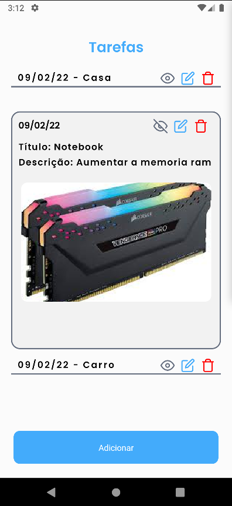
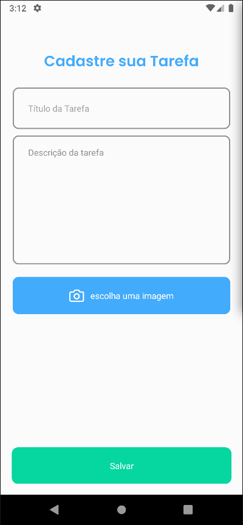

<div align="center">
  
</div>

<br />
<br />

<h2 align="center" font-size="30px">
  Desafio Técnico para BrickUp
</h2>
<br />

<div align="center">

</div>
<br /><br />

# Índice

- [Sobre](#sobre)
- [Telas](#telas)

- [Tecnologias Utilizadas](#tecnologias-utilizadas)
- [Como Usar](#como-usar)
  <br>
  <a id="sobre"></a>

<br>

## Sobre

<br>
O <strong>Task App</strong> é uma aplicação que foi desenvolvida para o desafio Técnico da empresa BrickUp.<br>

A idéia do desafio é desenvolver um App para tarefas.

Aonde você pode salvar, editar e deletar suas tarefas <br>

<br>

<a id="telas"></a>

<h2 align="center"> Tela principal.</h2>
<br /><br />


<br /><br />
<br /><br />
<h2 align="center"> Tela para registrar as tarefas</h2>
<br /><br /><br /><br />


<br /><br />

<br>
<a id="tecnologias-utilizadas"></a>
<br>

## Tecnologias Utilizadas

O projeto foi desenvolvido utilizando as seguintes tecnologias:

- [React Native](https://reactnative.dev/) <br>
- [Mobx](https://mobx.js.org/) <br>
- [Realm](https://realm.io/) <br>
- [React Navigation](https://reactnavigation.org/) <br>
  Dê uma olhada no package.json para saber tudo o que foi ultizado nesse app.

<br>
<br>

<a id="como-usar"></a>

- ### **Pré-requisitos**

  - É **necessário** possuir o **[Node.js](https://nodejs.org/en/)** instalado na sua máquina
  - Também, é **preciso** ter um gerenciador de pacotes seja o **[NPM](https://www.npmjs.com/)** ou **[Yarn](https://yarnpkg.com/)**.
  - É **necessário** possuir o **[Android](https://developer.android.com/studio)** instalado na sua máquina ou **[Xcode](https://developer.android.com/studio)** se você estiver usando MacBook
    <br>
    <br>

1. Faça um clone : <br>
   <br>

```sh
  $ git clone https://github.com/cesar-machado/desafio-tecnico.git
```

<br>
2. Abra o emulador do Android studio ou Xcode:

<br>
<br>
3. Executando a Aplicação:

```sh
  # Instale as dependências
  $ npm install ou yarn

  # Inicie a aplicação React JS
  $ cd desafio-tecnico

  $ npm start ou yarn start

  $ npm run android ou yarn run android

```

<h4 align="center">
    Feito com 💜 by <a href="https://www.linkedin.com/in/cesar-mach/" target="_blank">César Machado</a>
</h4>
